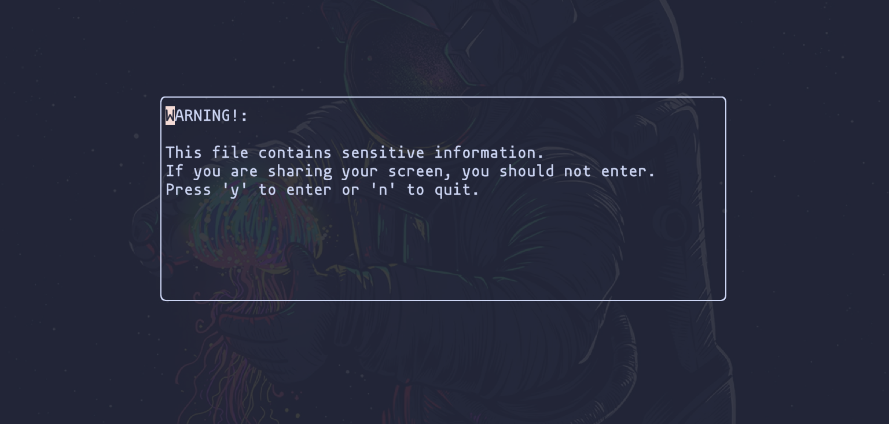

# keep-it-secret.nvim
<p align="center">
  
</p>

## What is Keep it Secret?

A plugin designed to keep your secrets safe! Useful for content creators or
anyone who finds themselves often sharing their screens to people who could be
annoying and use their secrets. This plugin shows a warning popup whenever
you enter a file you have specified usually contains your project secrets.

Additionally, this plugin is *persistant*. This means that if you toggle it on, close neovim, and open it again, it will still be on. Same thing for if you toggle it off. I did it this way because often times you close your neovim multiple times while streaming. If you could remember to turn it on every time you open and close neovim while streaming, you probably wouldn't need the plugin in the first place. So, I made it persistent to solve this issue!



## Documention

See `:help keep-it-secret.nvim`

## Installation
Packer: 
```lua
use("roberte777/keep-it-secret.nvim")
```

## Setup
Below is a sample setup with the default configs. If you do not wish to change the default configs, no setup call is required.
Additionally, the wildcards are lua's wildcard syntax, not regex!

```lua
require("keep-it-secret").setup({
	wildcards = { ".*(.env)$", ".*(.secret)$" },
	enabled = false
})
```
Sample key-bindings, you do need to set this up because ***I did not provide default keybinds***:
```lua 
vim.api.nvim_set_keymap(
	"n",
	"<leader>ks",
	":lua require('keep-it-secret').toggle()<CR>",
	{ noremap = true, silent = true }
)
```


